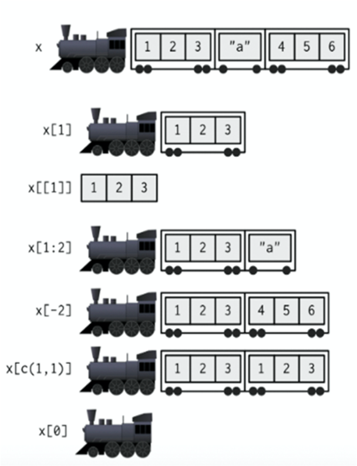

```{r configuracion, include = FALSE}
xaringanExtra::use_clipboard()
```
---

class: center, middle

### Este material posee una licencia tipo Creative Commons Attribution-ShareAlike 4.0 International License.

### Para conocer más sobre esta licencia, visite: [http://creativecommons.org/licenses/by-sa/4.0/](                   http://creativecommons.org/licenses/by-sa/4.0/)

---
class: chapter-slide

# Estructuras de datos en R

---
## R opera en estructuras de datos

 - Vectores
 - Matrices
 - Listas
 - Data frames
 - Funciones

En la primera sección de este curso aprendimos a usar vectores y manejar su
contenido.

---
class: chapter-slide

# Matrices

---

Una matriz es una estructura rectangular, que contiene datos de un solo tipo.

Son usadas principalmente en operaciones matemáticas y estadística.

Para crear una matriz usaremos la función **matrix()**.

Si usamos esta función sin proporcionar el número de renglones o columnas que
deseamos crear, por defecto hará el acomodo de los datos en una sola columna.

```{r}
matrix(1:12) 
```

---

Si especificamos el número de renglones que deseamos en la matriz, el arreglo
será diferente.

```{r}
matrix(1:12, nrow = 3)
```

Notemos que los datos comienzan a llenar las columnas de arriba a abajo y de 
izquierda a derecha.

---

Si le indicamos un número de columnas y renglones menor al número de datos, 
se usarán los que cubran los espacios en la matriz y el resto se descartará

```{r}
matrix(1:12, nrow = 3, ncol = 3)
```

Por otro lado, si le indicamos un número de columnas y renglones que sobrepasa
el número de datos disponibles, los datos se reciclan.

```{r}
matrix(1:12, nrow = 4, ncol = 4)
```

---

## Operaciones con matrices

Podemos aplicar operaciones matemáticas a las matrices

```{r}
matriz1 <- matrix(1:12, nrow = 3)
```

### Sumas y restas
```{r}
matriz1 + 1
```

---

### Multiplicación y división
```{r}
matriz1 * 2
```

### Potenciación
```{r}
matriz1 ^ 3
```

---

### Transposición
```{r}
t(matriz1)
```

---
### Operaciones entre matrices

```{r}
matriz1 + matriz1

matriz1 * matriz1
```

---
class: chapter-slide

# Listas

---
## ¿Qué es una lista?
Una lista es una colección ordenada de objetos, conocidos como componentes.

## ¿Cuáles son sus características?

- Los componentes pueden ser de diferente tamaño y clase.
- Las listas pueden contener vectores, matrices, cadenas de caracteres, data 
frames, funciones, etc.

---

Para crear una lista usaremos la función **list()**.

Veamos un ejemplo:

```{r}
frutas <- list(fruta = "manzana", unidades = 5,
               caracteristicas = c("roja","pequeña","dulce") )
frutas
```

---

Observemos que sus componentes se encuentran numerados, de manera que podemos
referirnos a ellos por su posición en la lista.

¿Cómo extraemos el elemento "fruta"?

```{r}
frutas[1]
frutas[[1]]
```

¿Cuál es la diferencia entre estas dos opciones? Vamos a revisar de qué clase 
es cada una de ellas

```{r}
class(frutas[1])
class(frutas[[1]])
```

---

## ¿Por qué son salidas diferentes? 

.center[
```{r, echo=FALSE, out.width="40%"}

```

Tomado de [Chapter 4 Subsetting. Advanced R. Second ed.](https://adv-r.hadley.nz/subsetting.html) by Hadley Wickham
]

---

Ahora, vamos a explorar los elementos del componente "caracteristicas".

Si el componente tiene múltiples elementos, usamos una segunda numeración para
referirnos al elemento deseado.

Para extraer la primera característica de la manzana (el color):

```{r}
frutas[[3]][1]
```

.center[ 
### ¿Cómo extraerías la característica que se refiere al dulzor de la fruta?
]
---

Otra forma de extraer los componentes de una lista es usando el símbolo $ y el
nombre del componente que deseamos extraer.

```{r}
frutas$unidades
frutas$caracteristicas
```

Esto es muy útil porque puede ser más fácil recordar el nombre del componente
que su posición en la lista.

Ahora, ¿cómo extraemos los elementos del componente característica usando $?

```{r}
frutas$caracteristicas[1]
```

.center[ 
### ¿Cómo extraerías la característica que se refiere al dulzor de la fruta usando $ ?
]
---
## Hagamos un pequeño ejercicio 

Generemos una nueva lista:

```{r}
jugadores <- list(nombre = c("Julie", "Juan", "Sofia"),
                  edad = c(22, 29, 34),
                  estatura = c(1.62, 1.75, 1.65))

```


.center[
### ¿Cómo podemos conocer la estatura de Sofía?

### ¿Cómo podemos obtener la edad de Julie y Juan al mismo tiempo?
]

---

Como alternativa, podemos usar el nombre del componente dentro de los corchetes.

```{r}
jugadores[["edad"]][1:2]
```

---

class: chapter-slide

# Data frames

---

## ¿Qué es un data frame?

Un data frame es una lista de vectores de la misma longitud en una estructura
rectangular, que R representa de forma similar a una tabla.

## ¿Cuáles son sus características?

- Su información está organizada en renglones y columnas.
- Sus vectores deben tener la misma longitud.
- Cada columna puede contener un tipo diferente de datos.

---

Para crear un data frame usaremos la función **data.frame()**.

Veamos un ejemplo:

```{r}
clima <- data.frame(dia = c(1,2,3,4,5),
                    temperatura = c(26,25,26,27,27),
                    nublado = c(1,0,0,1,1),
                    viento = c(5,3,2,3,6) )
clima
```

---
### ¿Cuáles son las dimensiones del data frame?

**dim()** nos mostrará el número de filas y columnas del data frame.

```{r}
dim(clima)
```

**nrow()** nos mostrará el número de filas.

```{r}
nrow(clima)
```

**ncol()** nos mostrará el número de columnas.

```{r}
ncol(clima)
```

---

### ¿Cuál es el nombre de las columnas y renglones de mi data frame?


**rownames()** nos muestra el nombre de los renglones.

```{r}
rownames(clima)
```

**colnames()** nos muestra el nombre de las columnas.

```{r}
colnames(clima)
```

---

Estas funciones también nos ayudan a cambiar los nombres de las columnas
y renglones

```{r}
colnames(clima)[4] <- "velocidad_viento"

rownames(clima) <- c("Lunes", "Martes", "Miércoles", 
                     "Jueves", "Viernes")

clima
```

---

## Otras formas de crear data frames

Podemos crear un data frame a partir de una lista, siempre que sus
componentes tengan la misma longitud

```{r}
df_jugadores <- as.data.frame(jugadores)
df_jugadores
```

---

Podemos importar un data frame desde un archivo usando la función **read.table()**.

```{r}
pinguinos <- read.table("pinguinos.txt", header = TRUE)
head(pinguinos)
```

Esta función tiene diversas opciones que podemos consultar en la ayuda
con help("read.table").

---

## ¿Cómo exporto mi data frame?

Podemos usar la función **write.table()**.

```{r}
write.table(jugadores, "jugadores.txt",
            quote = FALSE, row.names = FALSE)
```

Para ver los parámetros disponibles en esta función consultemos la ayuda con
help("write.table").


---

## ¿Cómo seleccionamos elementos del data frame?

La sintaxis para acceder a los elementos de un data frame es

.center[ 
 **nombre_del_dataframe[renglones, columnas]**
]

---
Veamos el renglón 5 del data frame pingüinos

```{r}
pinguinos[5,]
```


Veamos la columna 1 del data frame pingüinos

```{r}
pinguinos[,1]
```

Veamos los primeros 5 renglones

```{r}
pinguinos[1:5,]
```

---

Veamos los primeros 5 renglones y sólo la primera y segunda columna

```{r}
pinguinos[1:5,1:2]
```

Veamos los primeros 5 renglones y las columnas 1,3 y 5

```{r}
pinguinos[1:5,c(1,3,5)]
```

---
Veamos todo el set de datos, excepto la columna 5

```{r}
pinguinos[,-5]
```

---

También podemos seleccionar los datos usando su nombre de renglón o columna

```{r}
pinguinos["1", "especie"]
```

---

Así como en las listas, también podemos usar el símbolo $ para seleccionar una
columna del data frame

```{r}
pinguinos$isla
```

Y seleccionar elementos contenidos en la columna

```{r}
pinguinos$isla[1:3]
```

.center[ 
### En el data frame "clima" ¿Cómo obtendrías el valor de la temperatura del Viernes?
]

---

## Explorando los datos del data frame

Existen algunas funciones que nos ayudan a darle un vistazo a los datos:

**attributes()** nos muestra el nombre de las columnas y renglones, así como la
clase de nuestro objeto.

```{r}
attributes(pinguinos)
```

---

**str()** nos muestra la clase de cada vector que compone nuestro data frame.

```{r}
str(pinguinos)
```

---

**summary()** nos muestra datos estadísticos de cada uno de los vectores en el
data frame.

```{r}
summary(pinguinos)
```

---

## Filtrando datos de un data frame

Los corchetes nos ayudan a seleccionar datos que cumplen con una condición.

Seleccionemos los datos de los pingüinos del año 2009

```{r}
pinguinos[pinguinos$anio == 2009,]
```

---

Seleccionemos los datos de los pingüinos del año 2009 y tomemos sólo el nombre
de la especie

```{r}
pinguinos[pinguinos$anio == 2009,1]
```

Otra forma de hacerlo

```{r}
pinguinos[pinguinos$anio == 2009,"especie"]
```
---

Seleccionemos los pingüinos con un largo de pico mayor a la media

```{r}
media_pico <- mean(pinguinos$largo_pico_mm)

pinguinos[pinguinos$largo_pico_mm > media_pico,]
```

.center[
### ¿Cómo seleccionarías a los pingüinos que viven en la isla "Dream" ?
]

---

## Otros data frames en R

R contiene sets de datos de ejemplo, como airquality, que es un data frame.

Podemos acceder a sets de datos en español con el paquete "datos" que podemos
instalar desde CRAN con: 

.center[ **install.packages("datos")** ]

---

class: title-slide, center, middle


# ¡Gracias!

### Estas diapositivas fueron hechas utilizando el paquete [xaringan](https://github.com/yihui/xaringan) y configuradas con el tema [rmb](https://github.com/ComunidadBioInfo/minicurso_dic2020/tree/main/estructuras_de_datos/css).

Puedes consultar el material en [https://github.com/ComunidadBioInfo/minicurso_dic2020](https://github.com/ComunidadBioInfo/minicurso_dic2020)


